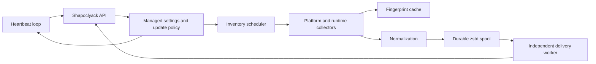

# Lariska

[Русская версия](README_RU.md) · [Documentation hub](wiki/Home.md) · [Installation](docs/INSTALL.md) · [Security](docs/hardening.md) · [Roadmap](WORKPLAN_RU.md)

Lariska is a lightweight, cross-platform endpoint inventory agent for the [Shapoclyack](https://github.com/onixus/Shapoclyack) platform. It inventories operating-system and runtime packages, classifies the host environment, and delivers authoritative endpoint snapshots without turning a workstation into an unwilling benchmark machine.

The source tree currently identifies itself as version **0.4.0**.

## What it does

| Area | Implemented behavior |
| --- | --- |
| Platforms | Linux, Windows, and macOS; release workflows cover Linux x86_64/aarch64, Windows x86_64, and macOS x86_64/aarch64 |
| OS inventory | `dpkg`, RPM, pacman, Windows uninstall registry and selected CBS updates, macOS application bundles and Homebrew |
| Runtime inventory | Python distributions, global Node.js packages, Java runtimes/JDKs |
| Host context | OS release, architecture, power source, containers, hypervisors, and common cloud environments |
| Scheduling | Deterministic fleet jitter, no overlapping scans, longer intervals on battery, managed intervals without restart |
| Local impact | Background/idle priority, trusted command paths, bounded command output, bounded metadata reads, persistent collector cache |
| Delivery | Compressed durable local spool, one-at-a-time recovery, independent delivery worker, retry/backoff, quarantine, crash recovery |
| Security | TLS by default, pseudonymized platform identifiers, secret-safe logs, validated remote settings, SHA-256 checked upgrades |

## Runtime architecture



The important separation is deliberate:

1. The inventory scheduler performs one bounded collection at a time.
2. Unchanged collectors can reuse a versioned persistent cache until the configured full-refresh deadline.
3. A collector failure marks the cycle non-authoritative. The daemon keeps diagnostics, but does not publish a partial snapshot that Shapoclyack could mistake for mass software removal.
4. An authoritative snapshot is atomically added to the local spool.
5. A dedicated worker owns authentication, HTTP retry, and spool draining. Network failure does not stretch the collection cycle.

See [Architecture](wiki/Architecture.md) for the module map, invariants, and data flow.

## Quick start

### Build

```bash
git clone https://github.com/onixus/Lariska.git
cd Lariska
cargo build --release
```

### Minimal configuration

```toml
server_url = "https://shapoclyack.example.com"
provisioning_key_file = "/etc/lariska/provisioning.key"
state_dir = "/var/lib/lariska"

inventory_interval_secs = 3600
heartbeat_interval_secs = 60
request_timeout_secs = 30
inventory_full_refresh_interval_secs = 86400
max_spool_entries = 200
log_level = "info"
```

Plain HTTP is rejected unless `allow_plain_http = true` is set locally. Insecure self-update requires the separate and deliberately louder `allow_insecure_updates = true` switch.

### Validate and run

```bash
./target/release/lariska check-config --config lariska.toml
./target/release/lariska inventory --output json
./target/release/lariska run --config lariska.toml
```

For systemd, launchd, Windows SCM installation, file locations, and verification, use the [installation guide](docs/INSTALL.md).

## Operational properties

- **Authoritative-only daemon submission.** A timeout, panic, unreadable registry branch, or failed package-manager command prevents publication of that cycle.
- **Bounded memory and disk use.** Command output, metadata files, cache entries, HTTP bodies, compressed spool input, and decompressed spool output have explicit ceilings.
- **Crash-safe delivery.** A snapshot is persisted before delivery and removed only after acknowledgement.
- **Persistent unchanged-state suppression.** The last accepted semantic digest survives restarts, and identical pending state is not repeatedly enqueued.
- **Fleet-safe scheduling.** Agent-specific jitter spreads startup and recurring load; collections cannot overlap or catch up in bursts.
- **Battery awareness.** The recurring inventory interval is stretched while running on battery, with a maximum effective interval.
- **Remote-policy containment.** Managed intervals and log levels are validated locally and applied atomically; transport and credential settings remain local-only.

## Known limits

These are current engineering boundaries, not marketing punctuation marks:

- Inventory schema v1 cannot faithfully represent every side-by-side installation that shares the same normalized product key. Schema v2 with installation identity is planned.
- HTTP inventory transport sends full JSON snapshots. Local spool data is zstd-compressed, but wire compression and delta submission are not yet enabled.
- Windows per-user inventory covers loaded user hives. Lariska deliberately does not mount every signed-out user profile.
- Snap, Flatpak, macOS package receipts, MSIX/AppX, and several language ecosystems are not collected yet.
- Upgrade artifacts are checked by target triple and SHA-256, but release-manifest signatures, native package-manager upgrades, and automatic health rollback remain roadmap work.
- Low-impact behavior is enforced structurally, but fleet SLOs for CPU time, peak RSS, disk reads, and collection latency still require published benchmark baselines.

## Documentation

- [Documentation hub](wiki/Home.md)
- [Architecture](wiki/Architecture.md)
- [Configuration](wiki/Configuration.md)
- [Collectors and completeness](wiki/Collectors.md)
- [Operations](wiki/Operations.md)
- [Security model](wiki/Security.md)
- [Troubleshooting](wiki/Troubleshooting.md)
- [Development](wiki/Development.md)
- [Technical plan](Plan.md)
- [Russian work plan](WORKPLAN_RU.md)
- [Release procedures](docs/RELEASE.md)
- [Changelog](CHANGELOG.md)

## Development and CI

```bash
cargo fmt --check
cargo clippy --all-targets --all-features -- -D warnings
cargo test --all-targets --all-features
cargo build --release
```

GitHub Actions validates formatting, strict Clippy, tests on Linux, Windows, and macOS, dependency and license policy, secret scanning, the APEX Architecture Contract, and the shared Shapoclyack inventory fixture. A declarative [Jenkinsfile](Jenkinsfile) is included for local CI deployments.

Changes that alter the inventory contract must update both repositories' fixture and document backward compatibility. The machine at the other end deserves slightly more consideration than “the JSON compiled.”
