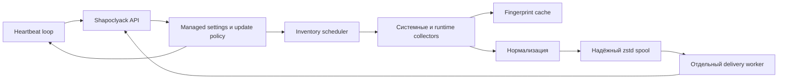

# Lariska

[English README](README.md) · [Документация](wiki/Home.md) · [Установка](docs/INSTALL.md) · [Безопасность](docs/hardening.md) · [План работ](WORKPLAN_RU.md)

Lariska — лёгкий кроссплатформенный endpoint-агент для платформы [Shapoclyack](https://github.com/onixus/Shapoclyack). Он собирает инвентаризацию операционной системы и runtime-окружений, определяет контекст хоста и доставляет достоверные snapshots, стараясь не превращать рабочую станцию в стенд нагрузочного тестирования без согласия владельца.

Текущая версия в исходном коде: **0.3.1**.

## Возможности

| Область | Реализовано |
| --- | --- |
| Платформы | Linux, Windows и macOS; release workflow собирает Linux x86_64/aarch64, Windows x86_64 и macOS x86_64/aarch64 |
| Системное ПО | `dpkg`, RPM, pacman, Windows Uninstall Registry и выбранные CBS-обновления, macOS application bundles и Homebrew |
| Runtime-пакеты | Python distributions, глобальные Node.js packages, Java runtimes/JDK |
| Контекст хоста | Версия ОС, архитектура, источник питания, контейнеры, гипервизоры и распространённые cloud-среды |
| Планирование | Детерминированный jitter, запрет параллельных сканов, увеличенный интервал на батарее, managed settings без перезапуска |
| Низкое влияние | Фоновый приоритет, trusted paths для команд, лимиты вывода и файлов, постоянный cache коллекторов |
| Доставка | Сжатый локальный spool, поштучное восстановление, отдельный delivery worker, retry/backoff, quarantine и crash recovery |
| Безопасность | TLS по умолчанию, псевдонимизированные идентификаторы, безопасные логи, локальная валидация remote settings, проверка SHA-256 обновлений |

## Как устроен рабочий цикл



Ключевые свойства:

1. Планировщик запускает только один ограниченный по ресурсам цикл сбора.
2. Неизменившиеся источники могут использовать версионированный persistent cache до наступления обязательного full refresh.
3. Ошибка любого обязательного коллектора делает цикл недостоверным. Диагностика сохраняется, но snapshot не отправляется, чтобы Shapoclyack не воспринял неполный список как массовое удаление ПО.
4. Достоверный snapshot атомарно записывается в локальный spool.
5. Аутентификация, HTTP retry и доставка выполняются отдельным worker. Недоступность сервера не растягивает период локального сканирования.

Подробности приведены в разделе [Архитектура](wiki/Architecture.md).

## Быстрый старт

### Сборка

```bash
git clone https://github.com/onixus/Lariska.git
cd Lariska
cargo build --release
```

### Минимальная конфигурация

```toml
server_url = "https://shapoclyack.example.com"
provisioning_key_file = "/etc/lariska/provisioning.key"
state_dir = "/var/lib/lariska"

inventory_interval_secs = 3600
heartbeat_interval_secs = 60
request_timeout_secs = 30
inventory_full_refresh_interval_secs = 86400
max_spool_entries = 200
log_level = "info"
```

Обычный HTTP запрещён, пока локально не задано `allow_plain_http = true`. Для обновления исполняемого файла через незащищённый канал существует отдельный параметр `allow_insecure_updates = true`, потому что одна опасная галочка, видимо, была бы недостаточно выразительной.

### Проверка и запуск

```bash
./target/release/lariska check-config --config lariska.toml
./target/release/lariska inventory --output json
./target/release/lariska run --config lariska.toml
```

Установка как systemd service, launchd job или Windows service, платформенные пути и проверка подключения описаны в [инструкции по установке](docs/INSTALL.md).

## Эксплуатационные гарантии

- **Только достоверные snapshots от daemon.** Timeout, panic, ошибка чтения registry или неуспешная команда пакетного менеджера блокируют публикацию текущего цикла.
- **Ограниченное потребление памяти и диска.** Для command output, metadata-файлов, cache, HTTP body, сжатого и распакованного spool заданы верхние границы.
- **Crash-safe доставка.** Snapshot сохраняется до сетевой отправки и удаляется только после подтверждения сервера.
- **Подавление неизменившегося состояния между перезапусками.** Последний принятый digest хранится на диске; одинаковые pending snapshots не накапливаются.
- **Безопасное поведение во флоте.** Jitter распределяет стартовую и периодическую нагрузку; циклы не перекрываются и не запускаются сериями после задержки.
- **Учёт батареи.** На батарее период inventory увеличивается, но ограничивается максимальным значением.
- **Локальный контроль remote policy.** Managed intervals и log level валидируются и применяются атомарно; URL, credentials, state paths и transport security нельзя изменить с сервера.

## Текущие ограничения

- Схема inventory v1 не умеет без потерь представлять все параллельные установки, имеющие одинаковый нормализованный product key. Для этого запланирована schema v2 с installation identity.
- По HTTP отправляется полный JSON snapshot. Локальный spool сжат zstd, но wire compression и delta submission пока не включены.
- Windows user-scope collector видит только загруженные пользовательские hives. Агент намеренно не монтирует профили вышедших из системы пользователей.
- Пока не поддержаны Snap, Flatpak, macOS package receipts, MSIX/AppX и ряд runtime-экосистем.
- Self-update проверяет target triple и SHA-256, но подписанный release manifest, установка через native package manager и автоматический health rollback ещё находятся в roadmap.
- Архитектура ограничивает влияние на хост, но публичные baseline/SLO для CPU time, peak RSS, disk reads и latency ещё требуется измерить на типовых системах.

## Документация

- [Главная страница документации](wiki/Home.md)
- [Архитектура](wiki/Architecture.md)
- [Конфигурация](wiki/Configuration.md)
- [Коллекторы и полнота данных](wiki/Collectors.md)
- [Эксплуатация](wiki/Operations.md)
- [Модель безопасности](wiki/Security.md)
- [Диагностика проблем](wiki/Troubleshooting.md)
- [Разработка](wiki/Development.md)
- [Технический план](Plan.md)
- [Актуальный план работ](WORKPLAN_RU.md)
- [Выпуск и rollback](docs/RELEASE.md)
- [История изменений](CHANGELOG.md)

## Разработка и CI

```bash
cargo fmt --check
cargo clippy --all-targets --all-features -- -D warnings
cargo test --all-targets --all-features
cargo build --release
```

GitHub Actions проверяет форматирование, строгий Clippy, тесты на Linux, Windows и macOS, зависимости и лицензии, утечки секретов, APEX Architecture Contract и общий fixture с Shapoclyack. Для локального CI также присутствует декларативный [Jenkinsfile](Jenkinsfile).

Изменения inventory-контракта должны сопровождаться обновлением fixtures в обоих репозиториях и описанием обратной совместимости. Иначе две системы очень уверенно согласятся лишь в том, что виновата другая.
