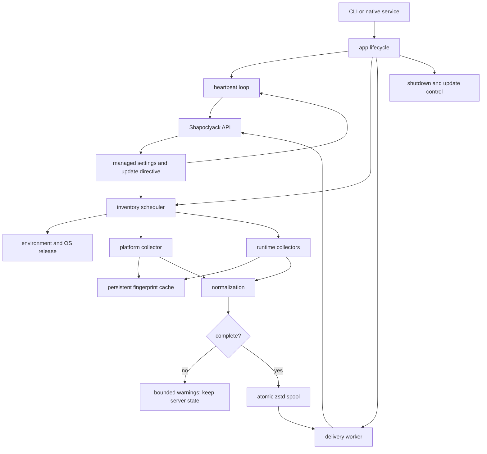

# Architecture

## Component model



## Independent loops

### Heartbeat

Registration and heartbeat are independent from inventory. The loop keeps the endpoint visible while a collector is slow or delivery is retrying. Heartbeat responses may carry managed intervals, log level, and update policy.

### Inventory

The scheduler uses a one-shot delay rather than a catch-up interval. The next collection is scheduled only after the current one finishes, so a slow disk cannot create overlapping scans. Agent-specific deterministic jitter spreads load across the fleet; battery mode stretches the recurring interval.

### Delivery

The inventory path only persists a complete snapshot and wakes the worker. The worker owns token acquisition, HTTP retries, queue draining, acknowledgement, and quarantine. Network failure therefore changes queue age, not local scan concurrency.

## Inventory pipeline

1. Read host context and power source.
2. Compute fingerprints for platform and runtime sources.
3. Load a compatible cache document when its fingerprint and age are valid.
4. Otherwise run the bounded collector and persist only a complete result.
5. Merge results while propagating completeness.
6. Normalize names, versions, architecture, source, and ordering.
7. Reject publication when the combined result is incomplete.
8. Create one schema-v1 snapshot ID and timestamp.
9. Enqueue the snapshot atomically.

The diagnostic `inventory` command may display partial entries and warnings because it is an operator tool. The daemon is stricter and does not publish partial state.

## Delivery pipeline

1. Enumerate queue paths oldest first using file metadata only.
2. Decode one entry under compressed and decompressed limits.
3. Validate the snapshot model.
4. Submit with the snapshot ID as the idempotency key.
5. Retry transient network/HTTP failures with bounded jitter and `Retry-After` support.
6. Quarantine validation, conflict, and payload-size failures that are specific to one snapshot.
7. Stop the current drain on systemic failures, retaining entries for the next worker cycle.
8. Persist the accepted semantic digest and timestamp.
9. Remove the acknowledged spool entry.

The persisted digest prevents unchanged snapshots from being re-enqueued after a restart. A return-to-baseline transition is still preserved when a different state is already queued.

## Module map

| Module | Responsibility |
| --- | --- |
| `app` | startup, orchestration, scheduling, shutdown |
| `config` | TOML/environment precedence and validation |
| `identity` | stable local agent ID and hashed matching evidence |
| `auth` | provisioning exchange and JWT refresh |
| `api` | bounded HTTP behavior and error classification |
| `heartbeat` | registration, heartbeat, managed directives |
| `managed` | remote setting validation and update staging |
| `inventory` | collection, cache, completeness, normalization inputs |
| `model` | versioned inventory wire/domain model |
| `delivery` | spool, retry, persistent accepted state, worker |
| `qos` | background priority, power state, CPU preference |
| `service` | instance lock and native service integration |
| `telemetry` | structured logging and runtime filter |
| `crash` | bounded panic report and next-start detection |

## Local state layout

Under the configured `state_dir`:

```text
state_dir/
  <identity and lock state>
  delivery-state-v1.json
  inventory-cache-v1/
    platform.json
    python.json
    nodejs.json
    java.json
  spool/
    <snapshot-id>.json.zst
    quarantine/
  crash_report.json            # only after a panic
  lariska-<version>.new        # only while staging an update
```

Names outside the documented versioned files may evolve. Operators should use supported cleanup procedures rather than scripting assumptions around every internal file.

## Architectural invariants

- Incomplete inventory never replaces complete server state.
- Collection never waits for HTTP delivery.
- Queue depth does not multiply decoded snapshots in memory.
- Untrusted inputs are bounded before or while being read.
- External commands use trusted absolute locations and no shell.
- Remote policy cannot change local credentials, endpoint URL, state path, or TLS exceptions.
- Acknowledgement is required before queue deletion.
- Wire-model changes require coordinated fixtures and rollout in Lariska and Shapoclyack.

## Known architectural debt

Schema v1 identifies a software product more strongly than an installation instance. It can therefore collapse side-by-side versions with the same normalized key. The next contract revision separates product and installation identity and adds per-source completeness, allowing healthy sources to advance while a failed source is carried forward safely.
